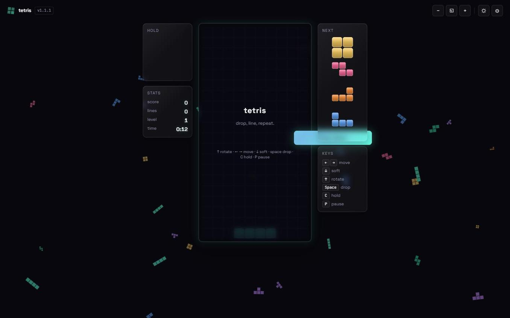

# 🟦 tetris

> Drop, line, repeat. A modern, offline-capable Tetris in pure HTML/JS — keyboard, touch & virtual pad, three themes (Classic B&W, Color, Modern Glass), and a **PGP-signed** scoreboard.

**Play it now → [tetris.rocks](https://tetris.rocks/)**

[](https://github.com/paulfxyz/tetris/releases/tag/v1.1.2)
[](LICENSE)
[](#)
[](#)
[](#)



---

## Why this exists

Two reasons:

1. **Every developer should have a Tetris in their portfolio.** It is the smallest game that still teaches you everything: a fixed timestep, collision detection, an input system, a state machine, audio, persistence, theming, and a server-side trust boundary.
2. **The web platform is enough.** Vanilla JS, Canvas, Web Audio, service workers, `<dialog>` — no React, no bundler, no `npm install`. Open `public/index.html` and it runs.

This one happens to also **cryptographically sign your high scores** so you can prove you actually got them.

This README doubles as a guided tour of the codebase — it's written for someone who wants to *learn* from the project, not just play it. Every JS module is also commented in the same spirit.

---

## Features

- 🎮 **Full Tetris guideline-ish gameplay** — 7-bag random, SRS-style kicks, hold, ghost piece, lock delay, soft/hard drop, level curve, T-spin-friendly scoring.
- 🎨 **Three distinct themes**, two modes, switchable on the fly:
  - **Classic** — strict B&W, Game Boy DMG / paper-terminal vibe. Zero tinted colour.
  - **Color** — Game Boy Color saturated palette with chunky pixel highlights/shadows.
  - **Modern** — animated glass tetrominoes, neon accents, subtle motion.
- 📱 **Plays everywhere** — keyboard, touch (drag to move, tap to rotate, swipe-down to hard drop), and an on-screen **virtual D-pad** that appears automatically on touch devices.
- 🔍 **Zoom in/out / fit to screen** — board scales independently for tired eyes and tiny phones.
- 🌑 **Plays offline** — PWA + service worker cache. Install it on your phone.
- 🪪 **PGP-signed scoreboard receipts** — finish a game, drop your name/tagline/email, and either download a signed `.txt` you can verify with `gpg --verify`, or submit to the public scoreboard.
- 🛠️ **Two self-hostable backends** — pick one:
  - **PHP** ([`server-php/`](server-php/)) — drops into any shared PHP host (Siteground, DreamHost, Hostinger, etc.). Used in production at [tetris.rocks](https://tetris.rocks/).
  - **Node + Fastify + SQLite** ([`server-node/`](server-node/)) — deploys to Fly.io with one command.

  Both hold the PGP private key off-disk (above webroot / as a Fly secret) and expose the same `/api/*` HTTP surface. Public key in the repo at [`docs/PUBKEY.asc`](docs/PUBKEY.asc).
- 0️⃣ **Zero frontend dependencies** — no React, no build step, no bundler. Just open `public/index.html`.

## Quickstart

```bash
git clone https://github.com/paulfxyz/tetris.git
cd tetris/public
python3 -m http.server 8000      # or any static server
open http://localhost:8000
```

To run the scoreboard server + PGP signing, see [INSTALL.md](INSTALL.md).

## Controls

| Action            | Keyboard            | Touch                       | Virtual pad |
| ----------------- | ------------------- | --------------------------- | ----------- |
| Move left / right | `←` / `→`           | Drag left / right           | ◀ / ▶       |
| Soft drop         | `↓`                 | Drag down                   | ▼           |
| Hard drop         | `Space`             | Swipe down quickly          | ⤓           |
| Rotate CW         | `↑` or `X`          | Tap                         | ↻           |
| Rotate CCW        | `Z`                 | —                           | —           |
| Hold              | `C` or `Shift`      | —                           | H           |
| Pause             | `P` or `Esc`        | —                           | —           |

DAS (delayed auto-shift) is built in for both keyboard and the virtual pad.

## Scoring

| Lines | Base score | × Level |
| ----- | ---------- | ------- |
| 1     | 100        | × level |
| 2     | 300        | × level |
| 3     | 500        | × level |
| 4 (Tetris) | 800   | × level |
| Combo (+ each consecutive clear) | 50 × combo × level |
| Back-to-back Tetris | × 1.5 multiplier |
| Soft drop | +1 per cell |
| Hard drop | +2 per cell |

Level advances every 10 lines. Gravity is `1000 × 0.85^(level-1)` ms per cell (clamped to 50 ms minimum).

---

## 🎓 Educational tour — read the code in this order

The frontend is intentionally small (~1,500 LOC of JS, ~600 of CSS). It is structured so that **each file does one thing**, and you can read them top-to-bottom in this order to understand how the whole game fits together:

1. **[`engine.js`](public/js/engine.js)** — *pure game logic*. No DOM, no canvas, no events. Reading this first teaches you the rules of Tetris in code: the board model, the 7-bag, SRS rotation, lock delay, line clearing, scoring. **If you only read one file, read this one.**
2. **[`renderer.js`](public/js/renderer.js)** — turns an Engine state into pixels on a `<canvas>`. Shows how to do high-DPI canvas, theme-aware drawing via CSS variables, ghost pieces and three different render styles from one drawing routine.
3. **[`input.js`](public/js/input.js)** — keyboard, touch and virtual D-pad. Demonstrates DAS/ARR (delayed auto-shift / auto-repeat rate), pointer-events, swipe detection without a library.
4. **[`app.js`](public/js/app.js)** — the glue. Boot sequence, the `requestAnimationFrame` loop, the overlay state machine (title / playing / paused / game-over), settings dialog wiring.
5. **[`scoreboard.js`](public/js/scoreboard.js)** — the network boundary. Same-origin `/api` autodetect, optional remote server URL, graceful degradation to local storage when offline.
6. **[`storage.js`](public/js/storage.js)** — 30-line settings persistence over `localStorage`. Worth reading to see how *little* code persistence actually needs.
7. **[`sound.js`](public/js/sound.js)** — procedural SFX with Web Audio oscillators. Zero audio assets shipped.
8. **[`background.js`](public/js/background.js)** — the floating tetrominoes behind the board. A small particle system.

Then the CSS:

9. **[`themes.css`](public/css/themes.css)** — three themes × two modes via CSS custom properties on `<html data-theme=… data-mode=…>`. Theming an entire game with ~20 tokens.
10. **[`game.css`](public/css/game.css)** — layout, the animations applied **only** to the Modern theme, footer styling.
11. **[`base.css`](public/css/base.css)** — reset, typography, button defaults.

And the backend (pick one):

- **[`server-php/api/index.php`](server-php/api/index.php)** — the whole API in one PHP file (~250 LOC). Routes, validation, GPG shell-out, SQLite storage. Perfect read for "PHP done in 2026".
- **[`server-node/index.js`](server-node/index.js)** — same surface, Fastify + better-sqlite3 + node-pgp.

---

## 🧠 Lessons learned (what this project actually taught me)

A list of the non-obvious things — for anyone building something similar.

### 1. Decouple the engine from everything

`engine.js` is a pure function over time: `tick(dt)`, `move(dx)`, `rotate(dir)` etc. It has no `console.log`, no `document`, no `setTimeout` and no audio. That single decision means:

- You can unit-test it by just `new Engine()` and calling methods.
- You can swap renderers (WebGL? SVG? ASCII?) without touching game logic.
- You can run it in a Web Worker if perf ever matters.
- You don't have a "is this a render bug or a logic bug?" debugging session — you can `console.log(engine.board)` after any input and see ground truth.

If you take one habit from this project: **the data model is not the view.** Build the data model first.

### 2. Fixed timestep > frame-counted gravity

Early naïve Tetris implementations drop the piece "every N frames". This breaks the moment your refresh rate changes (120 Hz monitors exist, mobile throttles to 30 Hz on battery). The right model is:

```js
engine.tick(deltaMs);  // engine accumulates time and drops when ≥ gravityMs
```

The render loop runs at whatever rate the browser gives us (`requestAnimationFrame`), and we just pass it the **elapsed milliseconds**. Gravity is then `1000 × 0.85^(level-1)` ms per cell. Same code plays identically at 30, 60, 120 or 240 Hz.

### 3. Lock delay is what makes Tetris feel modern

When a piece touches the stack, it does *not* lock immediately. It gets a 500 ms window during which moving or rotating resets the timer. This is the difference between "feels like an emulator from 1989" and "feels like modern Tetris". It's ~5 lines of code (`lockTimer` in `engine.js`) but it's the single biggest "game feel" win.

### 4. The 7-bag randomizer feels random *because* it isn't

Pure `Math.random()` piece selection famously gives you droughts ("I haven't seen an I-piece in 90 seconds, I'm dead"). The fix is the **7-bag**: shuffle all seven pieces, deal them out, refill. You're guaranteed to see every piece every 7 spawns. Players read this as fair; pure random reads as cruel. It's six lines of Fisher-Yates.

### 5. SRS kicks are a lookup table, not a clever algorithm

The Super Rotation System makes a piece "kick off the wall" when you rotate next to it. It looks like magic the first time you see it. The implementation is: a table of `(from, to) → [offsets]`, try each offset in order, take the first one that doesn't collide. That's it. The cleverness was in the *design* (which offsets to try, which order); the *code* is a 4-line loop.

### 6. Theming via CSS custom properties is borderline cheating

Three completely different visual styles share one HTML file and one JS bundle. Every theme-able value is a `--token` on `<html>`, and switching themes is one line: `document.documentElement.dataset.theme = 'classic'`. The renderer reads colors with `getComputedStyle(...).getPropertyValue('--piece-T')` so it doesn't even know themes exist.

This pattern scales: I used the same trick for `--board-style: 'flat' | 'pixel' | 'glass'` so the renderer picks a drawing path purely from CSS, without a JS theme registry.

### 7. Same-origin `/api` autodetect saves 40 settings dialogs

The frontend doesn't know whether you're playing on tetris.rocks (with a PHP backend), on a fork on Fly.io (Node backend), or on your laptop with no server at all. So `scoreboard.js` resolves the server URL like this:

```js
1. If the user pasted a manual URL in settings → use that.
2. Else if the page is on http(s) → assume same-origin /api.
3. Else (file://, no server) → offline mode, unsigned local receipts.
```

The result: no configuration to play, no configuration to self-host, and offline still works.

### 8. PWA caching is 30 lines and changes everything

`sw.js` precaches the game shell and serves cache-first. Hit it once on Wi-Fi, it works on the plane. The whole thing is small enough that you don't even need a workbox build step — write it by hand, version-bump the cache name on each release.

### 9. Procedural audio beats audio assets for tiny games

Every sound effect (move, rotate, drop, line, tetris, game over) is two oscillators + a gain envelope. ~40 lines total. No 200 KB of WAV files, no licensing question, no preloading concerns, no broken codec on iOS.

### 10. Two backends, same protocol = freedom

`server-php/` and `server-node/` expose the **same three endpoints** (`POST /sign`, `POST /submit`, `GET /scores`). The frontend doesn't care which one is on the other side. This means I can deploy the PHP one on Siteground for €4/month, or the Node one on Fly.io with autoscaling, and switch any time without touching the client.

---

## 🚧 Bottlenecks & gotchas I hit

The things that cost an hour or more.

### Canvas resize loses your transform

If you set `canvas.width = …` (to handle DPI or resize), the 2D context is reset to identity — your `setTransform(dpr,...)` is gone. You re-apply it inside the resize handler, but if you also call `clearRect(0, 0, rect.width, rect.height)` you're clearing the *CSS* rect, not the *bitmap* rect. On a DPR-2 display you only clear the top-left quarter of the canvas — and the bottom-right quarter shows ghost frames from earlier draws.

**The hold canvas in this game shipped with this bug.** It's why a screenshot during dev showed 4 stacked I-pieces in the HOLD panel (one piece overlaid on the ghost of the previous three). The fix is in `renderer.drawMini`:

```js
ctx.save();
ctx.setTransform(1, 0, 0, 1, 0, 0);  // identity
ctx.clearRect(0, 0, canvas.width, canvas.height);  // FULL bitmap
ctx.restore();
```

Always wipe the full bitmap before redrawing, then restore your DPR transform. Cost me a release.

### iOS Safari + Web Audio = locked until user gesture

`new AudioContext()` is created in `suspended` state on iOS until the user interacts with the page. If you create it on boot and try to play a sound from a `requestAnimationFrame` callback before the first tap, nothing comes out *and there's no error*. The fix: lazily create the audio context inside the first input handler (`sound.ensure()` is called from `startGame`).

### `localStorage` is blocked in cross-origin iframes

The game embedded inside a sandboxed preview iframe (some CMS embeds, some PaaS previews) won't be given `localStorage` by Safari. Every read throws. The defensive pattern is a tiny shim that wraps `localStorage` with an in-memory fallback — `try { localStorage.getItem(k) } catch { return mem[k] }`. The player just doesn't get persistent settings across reloads. The production tetris.rocks origin uses real `localStorage`.

### Cloud DNS for new domains: not actually broken, just slow

When tetris.rocks was first activated, `dig +short tetris.rocks @8.8.8.8` returned NXDOMAIN for 20+ minutes while Cloudflare 1.1.1.1 had the right answer instantly. The cloud-browser tool I use to verify deploys happens to use Google's resolver, so it kept reporting "site down" while real browsers were fine. Lesson: when a new domain looks dead, verify with multiple resolvers (`@1.1.1.1`, `@ns1.siteground.net` authoritative) before debugging.

### `.htaccess` `RewriteRule` order matters

The PHP backend needed `/api/*` → `api/index.php` rewrites plus an HTTPS-redirect rule plus a static-cache rule. If the HTTPS redirect is *after* the API rewrite, mobile Safari ends up POSTing to `http://` from a cached page and Siteground 301s the POST (losing the body) before PHP ever sees it. Move the HTTPS rule to the top.

### Anti-bot WAFs hate datacenter IPs

The first time I tried to `curl https://tetris.rocks/` from a cloud sandbox to verify the deploy, Siteground's SG-Captcha challenged me. From a residential IP / real browser it serves instantly. This is fine, but it means automated CI smoke-tests need a real browser context (Playwright) or an allow-listed health-check IP — `curl` from a cloud runner will return a CAPTCHA HTML page that looks like the site is broken.

### Mobile touch: distinguish tap from drag from swipe

The naïve implementation ("if touchend with no significant move → rotate") fires `rotate` every time the player drags-then-stops. The working version (in `input.js`) tracks three thresholds:

- Tap: `moved < 12px` AND `duration < 250ms` → rotate
- Drag: per-cell `22px` threshold along an axis → step move
- Swipe: `dy > 90px` AND `duration < 400ms` → hard drop

The numbers were eyeballed on three different phones; they're not magic, just tuned by feel.

### PGP keys must be **above webroot**

The PHP backend uses a real PGP private key to sign every receipt. If you put it in `public_html/` it is one path-traversal bug away from leaking. Siteground (and most shared hosts) let you put files in `/private/` *above* the webroot — invisible to the web. The PHP code reads from `__DIR__/../../private/pgp-private.asc` (resolved at deploy time). Node version: stored as a Fly secret env var, never written to disk in the container image.

---

## Project layout

```
tetris/
├── public/                  # the game — static, no build needed
│   ├── index.html
│   ├── manifest.webmanifest
│   ├── sw.js                # service worker (offline cache)
│   ├── css/
│   │   ├── base.css         # reset + typography + buttons
│   │   ├── themes.css       # classic / color / modern × dark / light
│   │   └── game.css         # layout + modern-theme animations + footer
│   ├── js/
│   │   ├── app.js           # boot, game loop, overlay state machine
│   │   ├── engine.js        # PURE game logic — start reading here
│   │   ├── renderer.js      # canvas board + hold + next + ghost
│   │   ├── input.js         # keyboard + touch + virtual pad
│   │   ├── background.js    # animated tetromino field
│   │   ├── sound.js         # procedural SFX (Web Audio)
│   │   ├── scoreboard.js    # /api client, offline fallback
│   │   └── storage.js       # localStorage settings store
│   └── assets/favicon.svg
├── server-php/              # PHP backend — runs on tetris.rocks
│   ├── api/index.php        # whole API in one file (PHP 7.4+)
│   ├── api/.htaccess        # /api/* → index.php
│   └── .htaccess            # webroot: HTTPS + caching + compression
├── server-node/             # Node + Fastify + SQLite (Fly.io)
│   ├── index.js
│   ├── scripts/keygen.js    # generates a fresh PGP keypair
│   ├── Dockerfile
│   ├── fly.toml
│   └── package.json
├── docs/
│   ├── PUBKEY.asc           # YOUR public key — replace before deploying
│   └── VERIFY.md            # how to verify a signed receipt
├── INSTALL.md               # set up the server + generate the PGP key
├── CHANGELOG.md
├── CONTRIBUTING.md
├── LICENSE
└── README.md                # ← you are here
```

## Signed receipts — what they look like

```
-----BEGIN PGP SIGNED MESSAGE-----
Hash: SHA256

===== TETRIS SCORE — SIGNED RECEIPT =====

Name:        Paul
Tagline:     just one more line…
Email:       hello@paulfleury.com

Score:       42360
Lines:       73
Level:       8
Time played: 6:42
Pieces:      214
Hard drops:  87
Soft drops:  1106
Rotations:   329
Holds:       12
Tetrises:    4
Max combo:   5

Theme:       modern
Client:      tetris 1.1.1
Played at:   2026-06-14T12:18:03.122Z
Public rank: #12

Issued at:   2026-06-14T12:18:03.401Z
Issuer key:  70B0 7D44 …  (your fingerprint)
-----BEGIN PGP SIGNATURE-----
…
-----END PGP SIGNATURE-----
```

Verify with `gpg --verify your-score.txt` after importing `docs/PUBKEY.asc`. See [`docs/VERIFY.md`](docs/VERIFY.md) for the full how-to.

## Privacy

- Email is **optional** and only used to disambiguate scoreboard entries — it is never published.
- The server stores: name, tagline (public), score, lines, level, duration, pieces, theme, played-at, and email (private).
- No tracking, no cookies, no third-party scripts.

## Ideas / not-yet-built

If you want to fork and learn by extending — these are the obvious next things, in roughly increasing difficulty:

- [ ] **T-spin detection** — already half-there (the rotation kicks expose enough info; you just need to check the 4 corners after lock).
- [ ] **Replay file format** — record the seed + every input event with a timestamp; replays are tiny and verifiable.
- [ ] **Daily seed mode** — same RNG seed for everyone today, leaderboard is per-day.
- [ ] **Garbage / versus** — peer-to-peer over WebRTC. The engine already supports injecting board rows.
- [ ] **WebGPU renderer** — fun but useless; the canvas2d renderer is faster than your monitor.
- [ ] **Spectator mode** — server-sent events stream of moves.

## License

[MIT](LICENSE). Fork, remix, ship.

---

Built with care by [@paulfxyz](https://github.com/paulfxyz) — part of the small-tools series alongside [`junk`](https://github.com/paulfxyz/junk), [`enki`](https://github.com/paulfxyz/enki), [`hollr`](https://github.com/paulfxyz/hollr), [`meet`](https://github.com/paulfxyz/meet) and friends.
